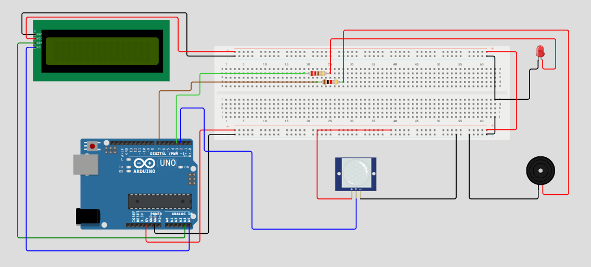

# SentryEye

**SentryEye** est un système de sécurité domotique basé sur Arduino, conçu pour détecter les mouvements avec un capteur PIR. Il déclenche des alertes visuelles (LED, écran LCD) et sonores (buzzer) dans un style inspiré des centres de surveillance policiers. Idéal comme projet éducatif ou base extensible.

## Matériel utilisé

- Arduino Uno (ou Nano)
- Capteur PIR
- LED + Résistance 220Ω
- Buzzer actif
- Écran LCD 16x2 (I2C)
- Fils Dupont
- Breadboard

## Structure du dépôt

```Plaintext
sentry-eye/
├── code/
│   ├── diagram.json             # Schéma de montage (Wokwi)
│   ├── libraries.txt            # Bibliothèques nécessaires
│   ├── sketch.ino               # Code principal Arduino
│   └── wokwi-project.txt        # Lien vers simulation Wokwi
├── images/
│   └── sentry-eye-arduino-schema-montage.png
├── LICENSE                      # Licence MIT
└── README.md                    # Ce fichier
```

## Schéma du montage



## Simulation en ligne

Simulez le projet sur Wokwi : 👉 [Lien Wokwi](https://wokwi.com/projects/436228847692394497)

## Fonctionnalités

- Détection de mouvement par PIR
- Allumage LED + activation buzzer
- Affichage LCD : messages style surveillance
- Code structuré et commenté
- Prêt pour extensions : RTC, carte SD, ESP, etc.

## Licence

Distribué sous licence MIT. Voir [`LICENSE`](LICENSE) pour plus d’informations.

